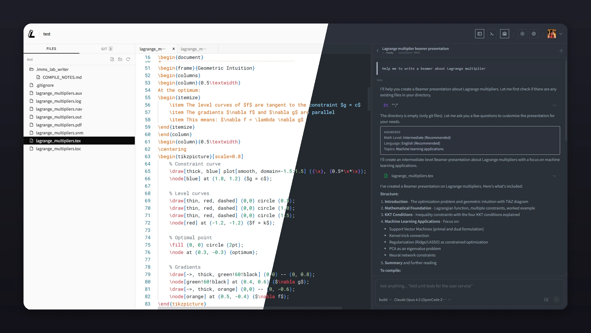

<div align="center">

<picture>
  <source media="(prefers-color-scheme: dark)" srcset="imgs/logo-dark.svg">
  <source media="(prefers-color-scheme: light)" srcset="imgs/logo-light.svg">
  
</picture>

**The AI-native LaTeX editor for researchers who'd rather focus on ideas than syntax.**

[](https://opensource.org/licenses/MIT)
[](https://github.com/EvolvingLMMs-Lab/lmms-lab-writer/releases)
[](https://github.com/EvolvingLMMs-Lab/lmms-lab-writer/releases)
[](https://github.com/EvolvingLMMs-Lab/lmms-lab-writer)

<a href="https://writer.lmms-lab.com/download"><strong>Download</strong></a> &nbsp;&middot;&nbsp;
<a href="https://writer.lmms-lab.com/docs"><strong>Documentation</strong></a> &nbsp;&middot;&nbsp;
<a href="https://writer.lmms-lab.com"><strong>Website</strong></a>

</div>

---



## Why LMMs-Lab Writer?

You're a researcher. Your time should go to breakthroughs — not LaTeX boilerplate, package conflicts, or copy-pasting between Overleaf and ChatGPT.

LMMs-Lab Writer is a local-first, AI-native LaTeX editor. Your files stay on your machine. AI agents edit them directly. You compile, review, and publish — all from one app.

## One-Click LaTeX Setup

No more hour-long TeX Live installations. LMMs-Lab Writer **auto-detects and installs a minimal LaTeX distribution** for you. If a package is missing during compilation, it gets installed automatically. Zero manual configuration — just open the app and start writing.

Supports **TinyTeX**, **MiKTeX**, **MacTeX**, and **TeX Live** — with one-click installation managed by the app.

## Built for Every Language

Write in **English, Chinese, Japanese, Korean, Arabic, or any language**. XeLaTeX and LuaLaTeX are first-class citizens with full Unicode and system font support. CJK documents work out of the box with `ctex`, `xeCJK`, and other multilingual packages. No extra configuration needed.

## AI-Powered Workflows with OpenCode

The built-in **OpenCode** panel puts AI directly inside your editor:

```
You: "Add a related work section comparing our method to LoRA and QLoRA"
Agent: *writes directly to main.tex in real-time*
You: *hit compile* Done.
```

- Chat with AI, attach files, manage sessions
- AI reads your entire project for full context
- Changes appear in the editor instantly
- Works with **any model** — Claude, GPT, Gemini, DeepSeek, local models

Also works with **Claude Code**, **Cursor**, **Codex CLI**, **Aider**, and any tool that can edit files. The editor watches your project directory and reflects all changes in real-time.

## Git Integration for Modern Collaboration

Git is not an afterthought — it's **built into the sidebar**:

- **Stage, commit, diff, push, pull** — all from the UI
- **AI-generated commit messages** from your staged changes
- **Side-by-side diff viewer** to review AI edits before committing
- **One-click GitHub publishing** — create repos and push without touching the terminal
- **GitHub CLI integration** for seamless authentication

No more paying $21/month for Overleaf's Git sync. Version control is free and first-class.

## Fully Open Source

MIT licensed. Every line of code is on GitHub. No vendor lock-in, no telemetry, no hidden costs.

- Your files **never leave your machine**
- AI tools use **your own API keys**
- Everything works **offline** (editing, compilation, Git)
- Fork it, modify it, self-host it — it's yours

## Cross-Platform

Runs natively on **macOS** (Apple Silicon & Intel) and **Windows** (64-bit). Built with [Tauri](https://tauri.app/) for native performance — not an Electron wrapper.

```bash
# macOS (Homebrew)
brew tap EvolvingLMMs-Lab/tap && brew install --cask lmms-lab-writer

# Or download from the website
```

[Download for macOS / Windows](https://writer.lmms-lab.com/download) | [All Releases](https://github.com/EvolvingLMMs-Lab/lmms-lab-writer/releases)

---

## Overleaf vs. LMMs-Lab Writer

| | Overleaf | LMMs-Lab Writer |
|---|---|---|
| **File storage** | Cloud only | Local (your machine) |
| **AI editing** | Basic grammar | OpenCode + any AI agent |
| **Non-English** | Limited CJK support | Full Unicode, XeLaTeX, system fonts |
| **LaTeX setup** | Pre-configured | One-click install, agent-managed |
| **Git** | Paid plans only | Free, built into sidebar |
| **Offline** | No | Full support |
| **Compilation** | Cloud queue | Local, instant |
| **Open source** | No | MIT license |
| **Price** | $21-42/month | Free |

## Quick Start

**1. Download & Install**

Download from [writer.lmms-lab.com/download](https://writer.lmms-lab.com/download), or install via Homebrew on macOS.

**2. Open Your Project**

Launch the app, click **Open Folder**, select your LaTeX project. The app detects your main file automatically.

**3. Write with AI**

Use the built-in OpenCode panel, or run any AI tool in the terminal:

```bash
claude "Write the abstract summarizing our three key contributions"
```

**4. Compile & Publish**

Hit compile. Review the PDF. Stage your changes, commit, push to GitHub — all from the sidebar.

## FAQ

**Do I need to install LaTeX separately?**
Not necessarily. The app can detect and install a minimal LaTeX distribution for you. Missing packages are auto-installed during compilation.

**Does it work with non-English documents?**
Yes. Full Unicode support via XeLaTeX and LuaLaTeX. CJK, Arabic, Cyrillic — all work out of the box.

**Is my data sent anywhere?**
No. All files stay on your machine. AI tools run locally or through your own API keys.

**Can I use this with Overleaf projects?**
Yes. Clone your Overleaf Git repo locally and open it in Writer.

**Does it work offline?**
Yes. Editing, compilation, and Git operations all work without internet.

## Development

```bash
git clone https://github.com/EvolvingLMMs-Lab/lmms-lab-writer.git
cd lmms-lab-writer
pnpm install
pnpm tauri:dev
```

See the **[Developer Guide](docs/dev.md)** for full architecture, tech stack, Rust commands, debugging, and contribution conventions.

## License

MIT

---

<div align="center">

**Built by [LMMs-Lab](https://lmms-lab.com)**

Every legendary paper started somewhere. Yours starts here.

</div>
