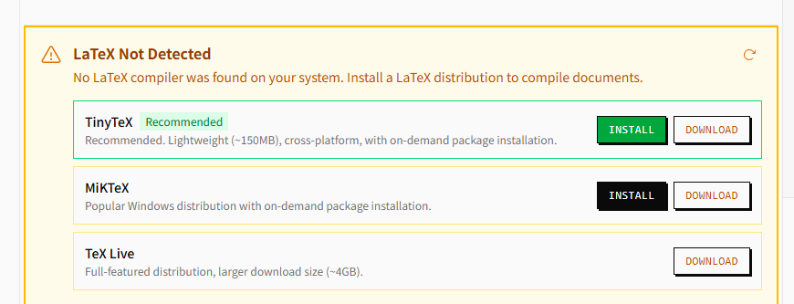
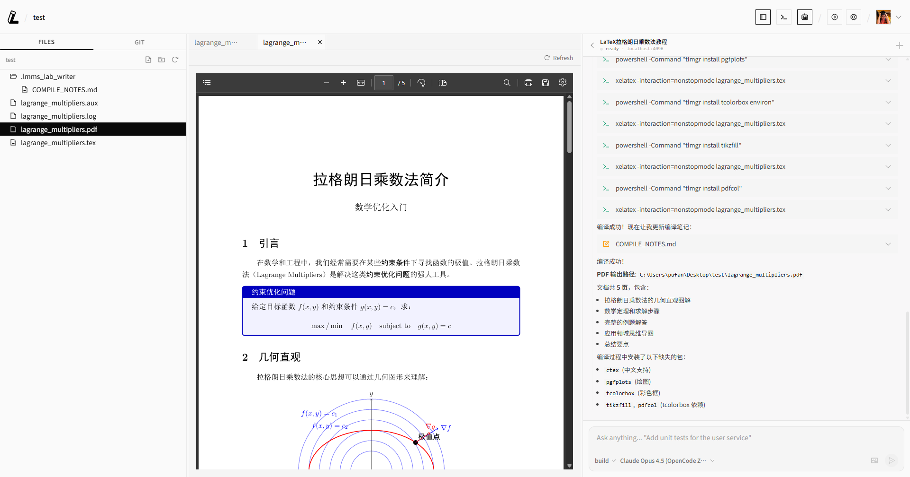
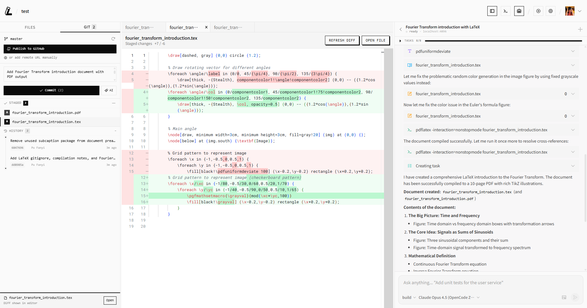
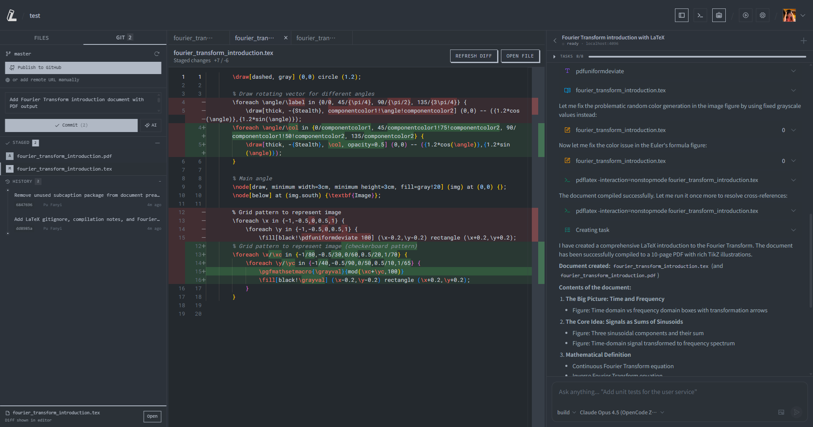

<div align="center">

<a href="https://writer.lmms-lab.com">
<picture>
  <source media="(prefers-color-scheme: dark)" srcset="imgs/logo-dark.svg">
  <source media="(prefers-color-scheme: light)" srcset="imgs/logo-light.svg">
  
</picture>
</a>

**言者所以在意、得意而忘言。**

[](https://writer.lmms-lab.com)
[](https://writer.lmms-lab.com/docs)
[](https://writer.lmms-lab.com/download)

[](https://github.com/EvolvingLMMs-Lab/lmms-lab-writer/releases)
[](https://github.com/EvolvingLMMs-Lab/lmms-lab-writer/releases)
[](LICENSE)
[](https://github.com/EvolvingLMMs-Lab/lmms-lab-writer)

[English](README.md) | [中文](README_zh.md) | 日本語

</div>

---


## なぜ LMMs-Lab Writer なのか？

あなたは研究者です。あなたの時間はブレークスルーに使うべきであり、LaTeX のボイラープレート、パッケージの競合、Overleaf と ChatGPT 間のコピー＆ペーストに費やすべきではありません。

LMMs-Lab Writer は、ローカルファースト・AI ネイティブの LaTeX エディタです。ファイルはあなたのマシンに保存されます。AI エージェントが直接編集します。コンパイル、レビュー、公開——すべてひとつのアプリで完結します。

## ワンクリック LaTeX セットアップ

TeX Live の長時間インストールはもう不要です。LMMs-Lab Writer は**最小限の LaTeX ディストリビューションを自動検出・インストール**します。コンパイル時にパッケージが不足している場合は自動的にインストールされます。手動設定ゼロ——アプリを開いてすぐに執筆を始められます。

**TinyTeX**、**MiKTeX**、**MacTeX**、**TeX Live** に対応——すべてアプリがワンクリックでインストールを管理します。

<div align="center">

</div>

## あらゆる言語に対応

**英語、中国語、日本語、韓国語、アラビア語、その他あらゆる言語**で執筆できます。XeLaTeX と LuaLaTeX はファーストクラスのサポートで、完全な Unicode とシステムフォントに対応しています。CJK ドキュメントは `ctex`、`xeCJK` などの多言語パッケージですぐに使えます。追加設定は不要です。

<div align="center">

</div>

## OpenCode による AI ワークフロー

内蔵の **OpenCode** パネルが、AI をエディタに直接統合します：

```
あなた：「LoRA と QLoRA との比較を含む関連研究セクションを追加して」
AI エージェント：*main.tex にリアルタイムで書き込み*
あなた：*コンパイルをクリック* 完了。
```

- AI とチャット、ファイルを添付、セッションを管理
- AI がプロジェクト全体を読み取り、完全なコンテキストを把握
- 変更がエディタに即座に反映
- **あらゆるモデル**に対応——Claude、GPT、Gemini、DeepSeek、ローカルモデル

**Claude Code**、**Cursor**、**Codex CLI**、**Aider** など、ファイルを編集できるあらゆるツールと連携可能。エディタがプロジェクトディレクトリを監視し、すべての変更をリアルタイムに反映します。

<div align="center">

</div>

## 組み込み Git コラボレーション

Git は後付けの機能ではありません——**サイドバーに組み込まれています**：

- **ステージ、コミット、差分表示、プッシュ、プル**——すべて UI から操作
- **AI によるコミットメッセージ生成**——ステージされた変更に基づいて
- **サイドバイサイド差分ビューア**——コミット前に AI の編集をレビュー
- **ワンクリック GitHub 公開**——ターミナルを開かずにリポジトリの作成とプッシュが可能
- **GitHub CLI 統合**——シームレスな認証

Overleaf の Git 同期に月額 $21 を支払う必要はもうありません。バージョン管理は無料でファーストクラスです。

<div align="center">

</div>

## 完全オープンソース

MIT ライセンス。すべてのコードが GitHub 上にあります。ベンダーロックインなし、テレメトリなし、隠れたコストなし。

- ファイルは**あなたのマシンから出ません**
- AI ツールは**あなた自身の API キー**を使用
- すべての機能が**オフラインで動作**（編集、コンパイル、Git）
- フォーク、修正、セルフホスト——すべて自由に

## クロスプラットフォーム

**macOS**（Apple Silicon & Intel）および **Windows**（64 ビット）でネイティブに動作。[Tauri](https://tauri.app/) で構築されたネイティブパフォーマンス——Electron ラッパーではありません。

<div align="center">
<table>
<tr>
<td align="center"><strong>ライトモード</strong></td>
<td align="center"><strong>ダークモード</strong></td>
</tr>
<tr>
<td></td>
<td></td>
</tr>
</table>
</div>

```bash
# macOS (Homebrew)
brew tap EvolvingLMMs-Lab/tap && brew install --cask lmms-lab-writer
```

またはウェブサイトから [macOS / Windows 版をダウンロード](https://writer.lmms-lab.com/download)。

---

## Overleaf vs. LMMs-Lab Writer

| | Overleaf | LMMs-Lab Writer |
|---|---|---|
| **ファイル保存** | クラウドのみ | ローカル（あなたのマシン） |
| **AI 編集** | 基本的な文法チェック | OpenCode + あらゆる AI エージェント |
| **非英語対応** | 限定的な CJK サポート | 完全な Unicode、XeLaTeX、システムフォント |
| **LaTeX セットアップ** | 事前設定済み | ワンクリックインストール、エージェント管理 |
| **Git** | 有料プランのみ | 無料、サイドバーに組み込み |
| **オフライン** | 非対応 | 完全サポート |
| **コンパイル** | クラウドキュー | ローカル、即時 |
| **オープンソース** | いいえ | MIT ライセンス |
| **価格** | $21-42/月 | 無料 |

## クイックスタート

**1. ダウンロード＆インストール**

[writer.lmms-lab.com/download](https://writer.lmms-lab.com/download) からダウンロード、または macOS では Homebrew でインストール。

**2. プロジェクトを開く**

アプリを起動し、**フォルダを開く** をクリックして、LaTeX プロジェクトを選択します。メインファイルは自動的に検出されます。

**3. AI で執筆**

内蔵の OpenCode パネルを使うか、ターミナルで任意の AI ツールを実行します：

```bash
claude "3つの主要な貢献を要約するアブストラクトを書いて"
```

**4. コンパイル＆公開**

コンパイルをクリック。PDF を確認。変更をステージし、コミットし、GitHub にプッシュ——すべてサイドバーから操作可能。

## よくある質問

**LaTeX を別途インストールする必要がありますか？**
必ずしも必要ありません。アプリが最小限の LaTeX ディストリビューションを自動検出・インストールできます。不足しているパッケージはコンパイル時に自動インストールされます。

**非英語ドキュメントに対応していますか？**
はい。XeLaTeX と LuaLaTeX による完全な Unicode サポートがあります。CJK、アラビア語、キリル文字——すべてすぐに使えます。

**データはどこかに送信されますか？**
いいえ。すべてのファイルはあなたのマシン上に保存されます。AI ツールはローカルで実行されるか、あなた自身の API キーを通じて利用されます。

**Overleaf のプロジェクトと一緒に使えますか？**
はい。Overleaf の Git リポジトリをローカルにクローンし、Writer で開いてください。

**オフラインで使えますか？**
はい。編集、コンパイル、Git 操作のすべてがインターネットなしで動作します。

## 開発

```bash
git clone https://github.com/EvolvingLMMs-Lab/lmms-lab-writer.git
cd lmms-lab-writer
pnpm install
pnpm tauri:dev
```

完全なアーキテクチャ、技術スタック、Rust コマンド、デバッグ方法、コントリビューション規約については **[開発者ガイド](docs/dev.md)** をご覧ください。

## ライセンス

MIT

---

<div align="center">

**[LMMs-Lab](https://lmms-lab.com) が開発**

すべての伝説的な論文には始まりがあります。あなたの論文は、ここから始まります。

</div>
